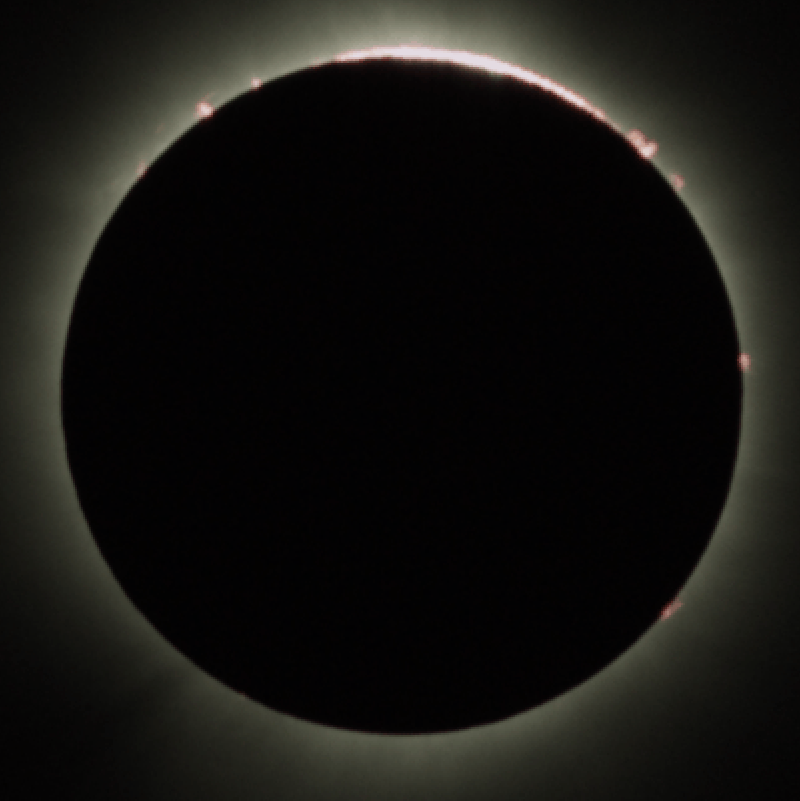
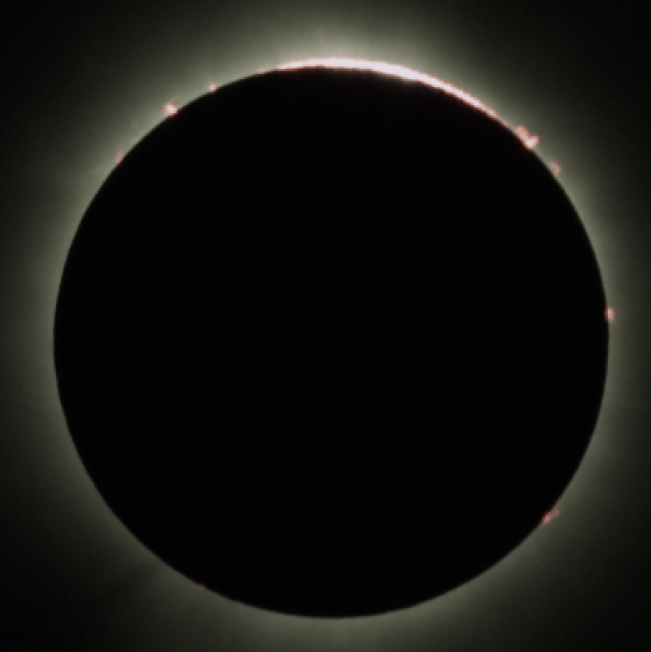
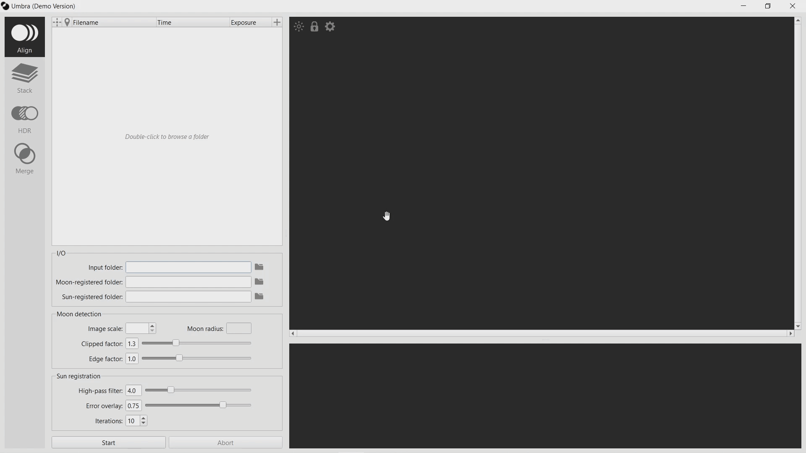
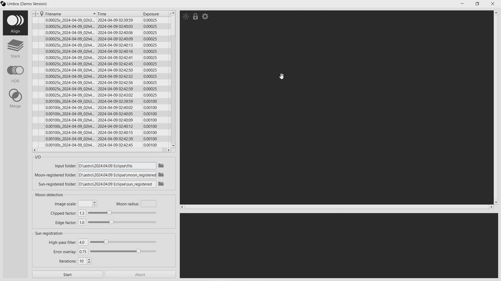
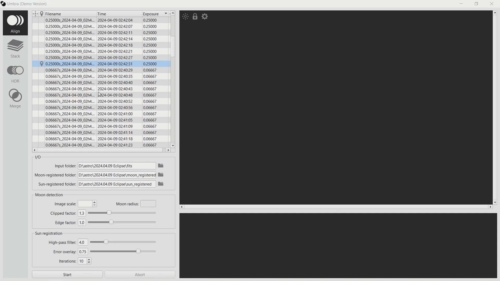

Umbra: Total Solar Eclipse Image Processing Software
==============

  
  
   
  <em>Images provided by @astro_uri on Instagram</em>

# Install
To use Umbra, download the appropriate `.zip` file for your operating system from the [latest release](https://github.com/LudoRey/umbra/releases/latest). Inside the extracted folder, you will find the executable. **Do not move the executable out of the folder**. If you want to have a standalone file on your desktop, create a shortcut.

Note: some antivirus software may flag the executable as a false positive; if this happens, add it to your antivirus exclusion list.

# Quick start

The software should be self-explanatory : you can hover over almost any element to see a tooltip explaining its function. To make things even easier, this quick guide will help you get started.

## Registration

Before using Umbra for image registration, you must convert your (debayered) images to FITS format, and place them in a single folder. **Do not organize your images into subfolders**.

1. Open the folder containing your FITS images.

2. Select a reference  and an anchor . Hover over the fileviewer header icons to see tips on how to make your selection.

3. Set your image scale and click on start.

The registered images are saved in the folders specified by the options "Moon-registered folder" and "Sun-registered folder". By default, they are located in the parent folder of the input folder.

# Join the Community

Have questions, want to discuss solar eclipses, or get help with Umbra? 
[Join our Discord server](https://discord.gg/Ayu7qaZETq).

# Source code

The source code for the algorithms is available if you want to run them without using the GUI. See the [documentation](docs.md) for more information. 