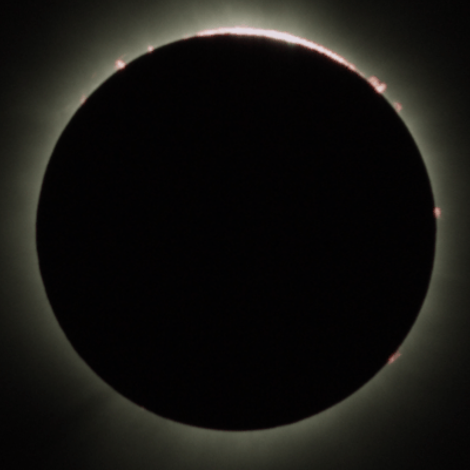
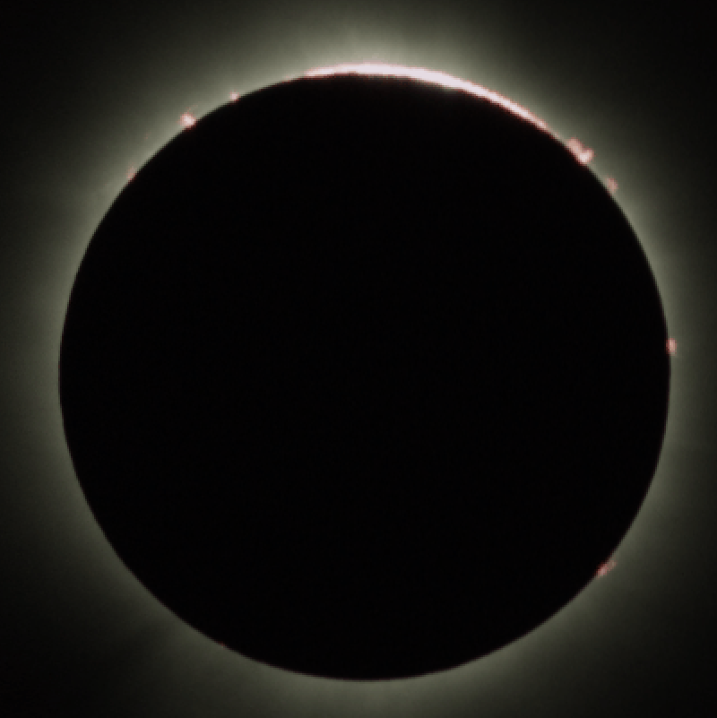

Umbra: Total Solar Eclipse Image Processing Software
==============

  
  
   
  <em>Images provided by @astro_uri on Instagram</em>

# Install
To use Umbra, download the appropriate `.zip` file for your operating system from the [latest release](https://github.com/LudoRey/umbra/releases/latest). Inside the extracted folder, you will find the executable. **Do not move the executable out of the folder**. If you want to have a standalone file on your desktop, create a shortcut.

Note: some antivirus software may flag the executable as a false positive; if this happens, add it to your antivirus exclusion list.

# Join the Community

Have questions, want to discuss solar eclipses, or get help with Umbra? 
[Join our Discord server](https://discord.gg/Ayu7qaZETq).

# Source code

The source code for the algorithms is available if you want to run them without using the GUI. See the [documentation](docs.md) for more information. 