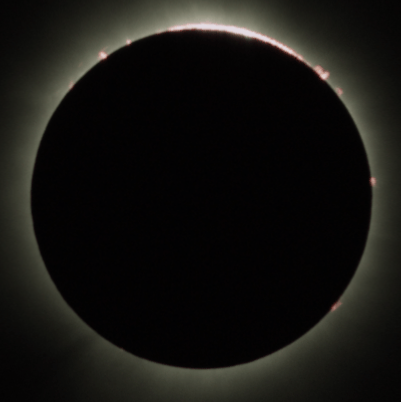
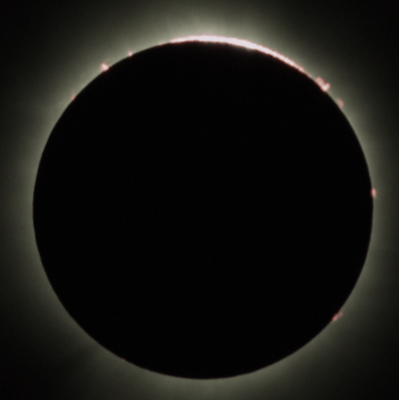

Umbra: Total Solar Eclipse Image Processing Software
==============

  
  
   
  <em>Images provided by @astro_uri on Instagram</em>

> [!IMPORTANT]
> **Umbra now has a website: [umbraprocessing.com](https://umbraprocessing.com)**
>
> Head there for downloads and guides — this repository only contains the source code for the algorithms (see below).

Umbra comes in two forms:

- **The Umbra app** — a desktop application for Windows and macOS. This is the one you want, unless you would rather drive the pipeline from a terminal, or want to see how the algorithms work.
- **The `umbra` package** — the Python implementation of those algorithms, which is what this repository holds. No GUI: you set the parameters in a configuration file and run the scripts. See the [documentation](docs.md) to get started.

# Join the Community

Have questions, want to discuss solar eclipses, or get help with Umbra? 
[Join our Discord server](https://discord.gg/Ayu7qaZETq).

# License

The `umbra` package is source-available under the [PolyForm Perimeter License 1.0.1](LICENSE.md). Run it, modify it and share it for any purpose, except providing others a product that competes with Umbra.
